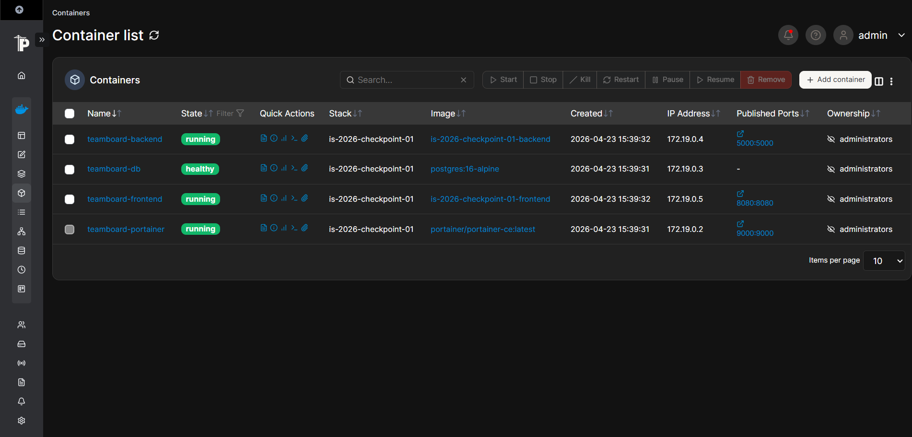

# is-2026-checkpoint-01

# **Integrantes:**

|  Feature  |   Responsable           |
|-----------|-------------------------|
|     1     |   Figueira Julian       |
|     2     |   La Gioiosa Bernardita |
|     3     |   Tundis Yamil          |
|     4     |   Bucchino Ulises       |
|     5     |   Amado Lautaro         |
 ------------------------------------

# **Instrucciones de uso:**

 1- Clonar el repositorio.
 
 2- Crear el archivo .env en la raiz del proyecto con las variables de entorno correspondientes, basándose en el archivo .env.ejemplo.
 
 3- Verificar tener el programa Docker.Dekstop abierto y en ejecución. 
 
 4- Una vez en la terminal, ejecutar el comando `docker compose up --build`.
 
 5- Se visualizarán los links para acceder a cada servicio:
 
  Frontend → http://localhost:8080;
    
  Backend → http://localhost:5000;
    
  Portainer → http://localhost:9000.

-----------------------------------------------

# **Descripción de Servicios:**

**Frontend:** Se presenta una página web simple, diseñada con HTML, que se abre en el navegador y muestra información del equipo, utilizando un servidor básico de Python para funcionar. Se conecta al backend mediante una petición a /api/team para obtener los datos y mostrar una tabla con los integrantes del grupo con sus respectivos datos (nombre, legajo, feature, servicio, estado), junto con un indicador que muestra si el backend está funcionando. Funciona dentro de Docker usando Python, escuchando en el puerto 8080.

**Backend:** Se encarga de la lógica y la comunicación entre el frontend y la base de datos. Expone una API REST que entrega los datos del equipo al frontend. Tiene endpoints como GET /api/health para verificar que el servicio esté activo, GET /api/team para obtener la lista de integrantes desde la base de datos PostgreSQL y GET /api/info para mostrar información del servicio. Funciona dentro de Docker usando Python, escucha en el puerto 5000 y obtiene las credenciales de la base de datos desde variables de entorno.

**DataBase:** Se almacena la información del equipo que luego utiliza el backend. Se utiliza PostgreSQL a través de la imagen oficial en Docker, sin necesidad de un Dockerfile propio. Su configuración se realiza desde docker-compose.yml, donde se definen las variables de entorno (usuario, contraseña y nombre de la base de datos). Los datos se guardan en un volumen para que no se pierdan al reiniciar el contenedor. Además, incluye un script init.sql que crea la tabla members e inserta los integrantes del grupo automáticamente la primera vez que se ejecuta.

**Panel de Monitoreo con Portainer:** A través de la interfaz Portainer se ven, administran y monitorean los contenedores Docker desde el navegador, sin usar la terminal. Dicha interfaz se configura en el docker-compose.yml utilizando la imagen portainer/portainer-ce:latest. A su vez, se establece la conexión al sistema Docker mediante el socket para poder ver y gestionar los contenedores del proyecto y se utiliza un volumen para guardar su configuración. Se accede desde el puerto 9000 en el navegador y la primera vez que se abre, solicita crear un usuario administrador.

---------------------------------------------------------------------------------------------------------------------------------------------------------------------------------

## Monitoreo con Portainer (Feature 05)

Este proyecto incluye **Portainer** como herramienta gráfica para los contenedores Docker. Nos permite ver, monitorear y administrar los contenedores Docker en tiempo real sin usar la terminal. No requiere Dockerfile propio ya que se configura desde docker-compose.yml

**¿Cómo acceder?**
1. Levantar los servicios con `docker compose up -d`.
2. Abrir el navegador e ingresar a: [http://localhost:9000](http://localhost:9000)
3. La primera vez que ingresamos, Portainer nos pide crear un usuario y contraseña de administrador.
4. Seleccionar el entorno local presionando en "Get Started" para ver los contenedores de TeamBoard.
5. Seleccionamos local lo que nos lleva al Dashboard, ahi buscamos en el menú lateral la opción containers y allí veremos el estado de los contendores:

